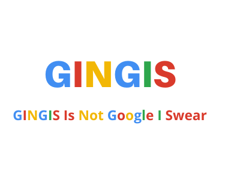

# Crie um catalogador de sites em Python

- Crie uma interface web onde possamos informar uma URL.
- Crie um Crawler que, a partir desta primeira URL,  seja capaz de identificar todos os links dentro da página e acessar cada um deles.
- Para cada link acessado, deve se repetir o processo acessando o link e identificando todas as URLs contidas nele para serem acessadas. Este processo deve se repetir até, pelo menos, 5 Níveis.
- implemente um algorítimo para ordenar os dez resultados mais relevantes.
- Crie os testes e a documentação para a API. 

&nbsp;

# GINGIS - GINGIS Is Not Google I Swear

  

* O projeto disponibiliza uma página web, onde se informa uma URL. apartir dessa URL a app busca os links presentes nessa página e faz o mesmo processo com os links encontrados. O processo se repete por 5 níveis, e no fianal são disponibilizados os 10 resultados mais relevantes.

- O projeto GINGIS foi feito em *Django* por esse framework fornecer uma integração mais simples com o banco de dados.

&nbsp;
# O model, ou banco de dados, foi criado da seguinte forma 

&nbsp;
## 
Links

|  Id  |   link   |  data da pesquisa  | titulo da página |  pontos  |
|:----:|:--------:|:------------------:|:----------------:|:--------:|
| 01 | https://google.com | 12/03/2022 | google| 1 |

Onde *pontos* será usado como critério de relevância para os links, cada vez que aquele link aparecer em uma scrape, será adicionado um ponto a e

&nbsp;

# Foi elaborado o módulo *raspagem* o qual é responsável por fazer o crawler da URL informada